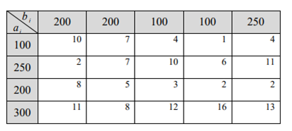
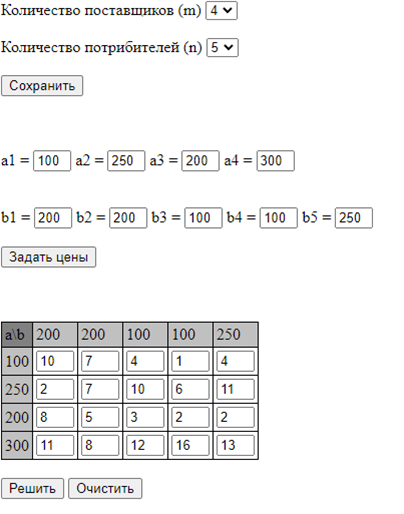
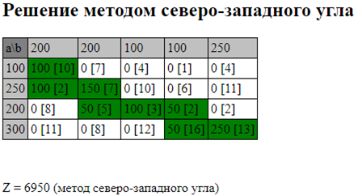
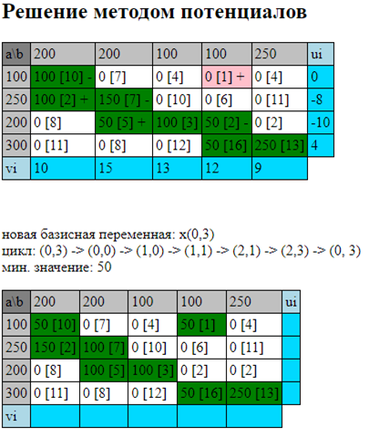
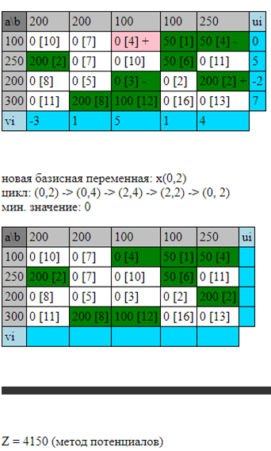

# Нахождения оптимального решения транспортной задачи методом потенциалов

## Решение для системы:  
  

 

## Поле для заполнения системы  
  

 
 

## Решение методом северо-западного угла  
  

 
 

## Решение методом потенциалов (начало)  
  

## Решение методом потенциалов (конец)  
  